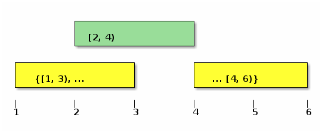
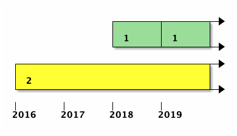
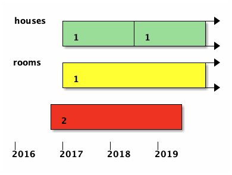
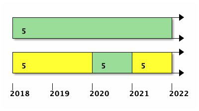
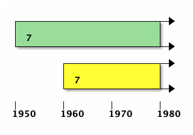

# Postgres Progress
## on Temporal Databases

Paul A. Jungwirth<br/>
23 April 2020<br/>
pxdpug

Note:

- Thanks for coming!


# Patches

- Multiranges
- SQL:2011 Temporal
  - Primary Keys
  - Foreign Keys
  - `UPDATE FOR PORTION OF`
  - `DELETE FOR PORTION OF`

Note:

- I've got two patches. Neither is finished yet.
  - Multiranges is close (I hope).
  - I want to talk about what these patches do, and also the approach I've used to implement them.
  - I'm happy for feedback on either of those things!

- Another talk I'd love to give is what I've learned as a newbie about Postgres hacking.
  - Both of these patches were great pedagogically to introduce me to different subsystems.
  - That is really a whole other talk (or several), but I can't resist sprinkling in some things here and there.


# Multiranges



Note:

- Range types have a start & stop
- Multiranges are like ranges, but they can have gaps.


# Multiranges

<pre><code>[1,3)
empty

{[1,3), [7,9)}
{}

<div class="fragment"><s>{empty}</s>
<s>{[1,4), [4,9), [6,9)}</s></div></code></pre>

Note:

- Here they are as strings.
- (next)
- They are automatically canonicalized, so you can't get these.


# Multiranges: Closure

<pre><code>
[1,4) + [7,9)       -- boom
[1,9) - [4,7)       -- boom

<div class="fragment">{[1,4)} + {[7,9)}   -- {[1,4), [7,9)}
{[1,9)} - {[4,7)}   -- {[1,4), [7,9)}</div></code></pre>


# Multiranges

ranges    | multiranges
--------- | --------------------
int4range | int4multirange 
tsrange   | tsmultirange 
...       | ...
anyrange  | anymultirange 
anycompatiblerange  | anycompatiblemultirange
textrange | textmultirange

Note:

- Every built-in range type comes with a multirange type
- Creating a new range type automatically creates a new multirange type


# Multiranges: Memory

```
typedef struct
{
    char    vl_len_[4];       /* varlena header */
    Oid     multirangetypid;  /* multirange type's OID */
    uint32  rangeCount;       /* the number of ranges */

    /* RangeType structs here, which are also varlena... */
} MultirangeType;
```

Note:

- They are varlena.
  - They have a count and then a bunch of ranges.
  - When iterating over the ranges you have to advance the pointer.
    - There is a `multirange_deserialize` function that gives you a `RangeType**` to avoid that.

- Btw a lot of the code I'll show has comments omitted and whitespace changed
  so what I want to show will fit on a slide.
  - Don't be alarmed! :-)

- Got a request to store less than the full RangeType in each entry,
  since they all contain the same type oid.
  - But only for on-disk possibly.
  - I actually don't know how to have an on-disk format different from in-memory.
  - But since most access goes through `multirange_deserialize` already,
    I think I could store something smaller and build the `RangeType` list on the fly.


# Multiranges: Operators

```
*ranges = palloc0(*range_count * sizeof(RangeType *));

ptr = (char *) multirange;
end = ptr + VARSIZE(multirange);
ptr = (char *) MAXALIGN(multirange + 1);
i = 0;
while (ptr < end)
{
    r = (RangeType *) ptr;
    (*ranges)[i++] = r;

    ptr += MAXALIGN(VARSIZE(r));
}
```

Note:

- this is from `multirange_deserialize`:
  - it does the pointer hopping to give you a list of ranges.


# Multiranges: Operators

```
= <> < <= > >=
<< >> -|-
@> <@ 
&> &<
&&
+ - *
```

Note:

- These are pretty much the same as ranges
- Many accept mixed ranges & multiranges
  - The idea is to make it easy to move between them.
- Nothing too interesting about implementing these.
  - I tried to delegate to range functions wherever possible.


# Multiranges: Identities

```
x + {} = x
x - {} = x
x * {} = {}

x @> y ≡ x + y = x
x @> {}
{} @> x ≡ x = {}

x && y ≡ x * y ≠ {} where x ≠ {} and y ≠ {}
x && {}
```

Note:

- There are lots of mathy properties of ranges that multiranges preserve.
- Ranges and multiranges have nice additive properties:
  - `{}` is an additive identity
- Thinking about ranges mathematically is fun but as far as I can tell there aren't nice multiplicative properties.
  - For example what is the multiplicative identity? If it's (null,null) then you can't find inverses.
  - But at least we can say that x * 0 = 0.

- x includes y is the same as saying that y adds nothing new to x.
- every range includes the empty range.
  - Even the empty range includes the empty range.
  - If the empty range includes something, it must be empty too.

- x overlaps y is the same as saying that x intersects y is not empty (unless x or y are empty already)
- empty overlaps every range (just like it's contained by them)

- Anyway all this is just to say that I'm trying not to *lose* anything from ranges.
- In all these formulas, you can put ranges *or* multiranges for x and y.


# Multiranges: Polymorphic

| poly | concrete |
| ---- | -------- |
| anyelement    | integer
| anyarray      | integer[]
| anyrange      | int4range
| anymultirange | int4multirange |

Note:

- If any of these are known, the polymorphic type system can infer the others.
- Except a known element/array doesn't let you infer the range/multirange,
  because you can define multiple range types for the same base type.
- But a known range lets you infer a multirange and vice versa


# Multiranges: Functions

```
lower(anymultirange) returns anyelement
upper(anymultirange) returns anyelement

multirange(r anyrange) returns anymultirange
range_merge(r anymultirange) returns anyrange

range_agg(r anyrange) returns anymultirange
range_intersect_agg(r anyrange) returns anymultirange
```

Note:

- Multiranges comes with a few non-operator functions.
  - `lower` & `upper` return what you'd expect
  - `multirange` is a constructor from a single range.
    - There are variadic type-specific constructors, but it's handy to have one that works for any type.
  - `range_merge` gives the range that includes the whole multirange
    - Sort of the opposite of the constructor
  - `range_agg` is an aggregate function:
    - Take a lot of ranges and combine them. 
  - `range_intersect_agg` is the same but instead of `+` it's `*`.


# Multiranges: Selectivity

<pre><code>{ oid => '8073',
  oid_symbol => 'OID_RANGE_OVERLAPS_MULTIRANGE_OP',
  descr => 'overlaps', oprname => '&&',
  oprleft => 'anyrange', oprright => 'anymultirange',
  oprresult => 'bool',
  oprcom => '&&(anymultirange,anyrange)',
  oprcode => 'range_overlaps_multirange',
  <b>oprrest => 'multirangesel'</b>,
  oprjoin => 'areajoinsel' },
</code></pre>

Note:

- Still working on this actually
- I added a `multirangesel` function
- A lot like ranges
- Analysis builds historgrams of lower/upper and length
- Selectivity is easy (scalar-like) for everything but contains/overlaps.
  - Those require both a lower/upper and a length.
  - This is just what rangesel does.
- This will be biased toward denser multiranges: ones without gaps.
  - Probably good to add a "density" histogram we can combine with length
    - Or even redefine length as length times density.


# Primary Keys

```
CREATE CONSTRAINT pk_houses
  PRIMARY KEY
  (id, valid_at WITHOUT OVERLAPS);
```

Note:

- This is what you say to define a temporal primary key.
- Id is an ordinary column, like an integer.
- `valid_at` is a range column, or hopefully soon a PERIOD.
  - PERIODs are weird SQL:2011 things that are like ranges but worse.
  - I'd like to support both.
- Of course you can also specify a temporal PK in your CREATE TABLE.


# Primary Keys



Note:

- It's okay if you have a duplicate of the ID, but not if their times overlap.


# Primary Keys

```
IndexElem *iparam = makeNode(IndexElem);
iparam->name = pstrdup(without_overlaps_str);
index->indexParams = lappend(index->indexParams, iparam);

opname = list_make1(makeString("&&"));
index->excludeOpNames = lappend(index->excludeOpNames, opname);
index->accessMethod = "gist";
constraint->access_method = "gist";
```

Note:

- Normally PKs are a UNQIUE constraint with an appropriate index.
- Temporal PKs are EXCLUSION constraints with a different kind of index.
- There is already code to include all the scalar parts in the index.
- We add code to include the WITHOUT OVERLAPS part
  - Also use the overlaps operator instead of the equals operator.


# Foreign Keys

```
CREATE CONSTRAINT fk_rooms_to_houses
  FOREIGN KEY
  (house_id, PERIOD valid_at)
  REFERENCES
  (id, PERIOD valid_at);
```

Note:

- It's kind of a shame we use `WITHOUT OVERLAPS` for a PK and `PERIOD` for a FK.
  - Also note the `PERIOD` comes before the column name but `WITHOUT OVERLAPS` comes after.
- Of course you can also specify a temporal FK in your CREATE TABLE.


# Foreign Keys



Note:

- The FK has to be present in the referenced table *for the whole time*
- It might take more than one row in the PK table to cover the whole FK range.
  - example
  - So how do you implement that?
    - You need to roll up all rows with the same scalar key part and combine their ranges into one big range.
      - Maybe the resulting range even has gaps.
      - Sounds like a job for ... multiranges!
      - range_agg (hold that thought....)


# Foreign Keys

```
SELECT 1
FROM   houses x
WHERE  id = $1
FOR KEY SHARE OF x;
```
<!-- .element: class="fragment" -->

Note:

- Ordinary FKs are actually hidden constraint triggers.
- They are AFTER ROW.
- There are 2 on the referencing table and 2 on the referenced table.
- Temporal FKs are the same way but just slightly different trigger functions.
- In all cases the triggers just run some SQL to make sure the referential integrity still holds
  - (next) Here is that SQL
  - $1 is the new FK value.
    - We want to make sure the PK has that value too.


# Foreign Keys

```
SELECT 1
FROM (
    SELECT valid_at AS r
    FROM   houses x
    WHERE  id = $1
    AND    valid_at && $2
    FOR KEY SHARE OF x
) x1
HAVING $2 <@ range_agg(x1.r);
```

Note:

- Here is the same query but for temporal FKs
- First the pedantic stuff:
  - Obviously the table and column names are not hardcoded.
  - More than one scalar column is supported.
  - If it's not a partitioned table we say `FROM ONLY` (like other FK checks)
- $1 is the FK scalar value.
- $2 is the FK range value.
- Walk through:
  - So we pull out all the `valid_at` ranges for that ID...
  - we only look at rows that overlap $2 as a small optimization. Rows outside of the FK range are irrelevant.
  - merge them together...
  - and make sure they completely contain the FK range.
- This is trickier than it needs to be because of the locking.
  - `FOR KEY SHARE` is a very light lock really just used for FK checks.
  - It doesn't support aggregate queries though, so we have to aggregate outside that subquery.
- This query is for if the FK side changes.
  - The query for if the PK side changes is simpler.
    - No need for `range_agg`.
    - It looks for FK rows that *still* match the old PK values.
    - In fact no changes needed at all.
      - = operator for the scalar parts
      - && operator for the range part


# Foreign Keys

<pre><code>CREATE CONSTRAINT fk_rooms_to_houses
  FOREIGN KEY
  (house_id, PERIOD valid_at)
  REFERENCES
  (id, PERIOD valid_at)
<div class="fragment">  ON DELETE CASCADE
  ON UPDATE CASCADE;</div></code></pre>

Note:

- So let's go back to our SQL statement....
- (flip to next slide)
- What about CASCADE?
  - What does it even mean?
    - I means we delete/update the affected region of the referencing table.
- Cascade is actually easy to implement *if* we have temporal update/delete.
  - So let's go to that....


# UPDATE

```
UPDATE houses
  FOR PORTION OF valid_at
  FROM  '2020-01-01' TO '2021-01-01'
  SET   tax_appraisal = 250000
  WHERE id = 5;
```



Note:

- Examples
  - Update the property tax appraisal for the year.
  - Discover a house wasn't build until 1960.
- In implementation these are practically the same, so I'll treat them together.


# DELETE

```
DELETE FROM houses
  FOR PORTION OF valid_at
  FROM  '1950-01-01' TO '1960-01-01'
  WHERE id = 7;
```



Note:

- Delete is very similar


# UPDATE/DELETE

- Parse
- Analyze
- Rewrite
- Plan
- Optimize
- Execute

Note:

- unlike temporal integrity constraints, these go through the whole query pipeline.
  - making keys are "utility" commands so they skip the planner & optimizer.
  - But DML goes through all the steps.

- Parse: just pull out the strings into appropriate structs. Don't try to do anything yet.
- Analyze: make sure columns really exist, turn things into a Node tree for expressions, column references, function calls, operators.
- Rewrite: transform the query if we think that will help.
- Plan: generate lots of possible plans.
  - Each plan is another tree of Nodes.
- Optimize: choose the plan that seems best.
  - If you `EXPLAIN` you can see the plan's node tree, basically.
- Execute: nodes that actually do everything.
  - In my case, everything else was easy, just copying things from one struct to another,
  - ...but here things got really hard.
    - TupleTableSlots
    - Locking and transaction isolation

- I've noticed a lot of submissions on hackers get rejected because all the work happens in the process, e.g. in the analysis or rewriting phase


# UPDATE/DELETE: Parse

`parsenodes.h`

```
typedef struct ForPortionOfClause
{   
    NodeTag     type;
    char       *range_name;
    int         range_name_location;
    Node       *target_start;
    Node       *target_end;
} ForPortionOfClause;
```

Note:

- We fill this in in the bison file.


# UPDATE/DELETE: Parse

```
for_portion_of_clause:
      FOR PORTION OF ColId FROM Sconst TO Sconst
        {
          ForPortionOfClause *n = makeNode(ForPortionOfClause);
          n->range_name = $4;
          n->range_name_location = @4;
          n->target_start = makeStringConst($6, @6);
          n->target_end = makeStringConst($8, @8);
          $$ = n;
        }
      | /*EMPTY*/         { $$ = NULL; }
    ;
```

Note:

- This is from `gram.y`
- `range_name` is a column name or PERIOD name.
- `target_start` and `target_end` are always strings.
  - That's what the spec says.
  - I don't see why we couldn't accept expressions, column values, maybe even subqueries.
  - At least NOW(), right?
    - Mariadb accepts NOW() and date arithmetic functions, maybe other things.


# UPDATE/DELETE: Analyze

```
FOR PORTION OF valid_at
  FROM  '2020-05-30'
  TO    '2021-01-31'
```

Note:

- Copy stuff from the previous struct to a new one with more information.
- Make sure it's a column.
- Make sure the column is a range.
- Make sure the table has a temporal PK.
- Make sure the range is part of the PK.
- Building a lot of expression nodes.


# UPDATE/DELETE: Analyze

```
FuncCall *fc = makeFuncCall(
        SystemFuncName(range_type_name),
        list_make2(result->targetStart,
                   result->targetEnd),
        forPortionOf->range_name_location);
result->targetRange = transformExpr(
        pstate,
        (Node *) fc,
        EXPR_KIND_UPDATE_PORTION);
result->overlapsExpr = (Node *) makeSimpleA_Expr(
        AEXPR_OP, "&&",
        (Node *) result->range,
        (Node *) fc,
        forPortionOf->range_name_location);
```

Note:

- So the analysis phase has to take the parse result and make real node trees.
- Here we have a function call node.
  - It will call the range constructor with the FOR PORTION OF endpoints.
  - We also build Node to call the "overlaps" operator on that range and the range column.


# UPDATE/DELETE: Analyze

```
if (stmt->forPortionOf)
{
    if (stmt->whereClause)
        whereClause = (Node *) makeBoolExpr(
            AND_EXPR,
            list_make2(qry->forPortionOf->overlapsExpr,
                       stmt->whereClause),
            -1);
    else
        whereClause = qry->forPortionOf->overlapsExpr;
}
else
    whereClause = stmt->whereClause;
```

Note:

- Use FOR POTION OF to add an implicit condition to the WHERE clause.
- This is close to rewriting; maybe it's even in the wrong place.
- If you `EXPLAIN` then you see this other condition.


# UPDATE: Analyze

```
Expr *rangeSetExpr = (Expr *) makeSimpleA_Expr(
        AEXPR_OP, "*",
        (Node *) result->range,
        (Node *) fc,
        forPortionOf->range_name_location);

rangeSetExpr = (Expr *) transformExpr(
        pstate,
        (Node *) rangeSetExpr,
        EXPR_KIND_UPDATE_PORTION);
TargetEntry *tle = makeTargetEntry(
        rangeSetExpr,
        range_attno,
        range_name,
        false);

targetList = lappend(targetList, tle);
```

Note:

- We also build a Node for the "intersects" operator,
  which we use to UPDATE the range column.
- fc is the range constructor expression from above
- The "target list" is all the things the UPDATE will update
  - (or that SELECT will select, incidentally).
- foo*


# UPDATE/DELETE: Analyze

```
FOR PORTION OF valid_at
  FROM  '2020-05-30'
  TO    'Infinity'
```

Note:

- How should we deal with "update from now until further notice"?
- With ranges this is NULL.
- In the spec you're supposed to have a sentinel like January 1, 3000.
- That's so ugly though.
- Oracle lets you have PERIODs with NULL endpoints and treats them how our ranges treat NULLs: unbounded.
  - I imagine our PERIODs should be the same.
- But what do you write in the FOR PORTION OF?
  - NULL? Maybe that's the right answer. Right now I only accept a string though.
- But 'Infinity' and '-Infinity' are both strings, so that are accepted.


# UPDATE/DELETE: Analyze

```
=# SELECT tstzrange(NOW(), NULL)
-#      - tstzrange(NOW(), 'infinity');
```

Note:

- What do you suppose this will be?


# UPDATE/DELETE: Analyze

```
=# SELECT tstzrange(NOW(), NULL)
-#      - tstzrange(NOW(), 'infinity');
  ?column?   
-------------
 [infinity,)
(1 row)
```

Note:

- But +/- Infinity cause problems because there is a tiny slice between infinity and null.
- Also those strings aren't valid for any type you might make a range with.
- (They are valid for all our built-in range types, but that's not good enough.)
- So I feel like I need to change this. Maybe just accept NULL there too.
- That still leaves a footgun for people to use `Infinity` and get weird effects.
  - But that footgun already exists with ranges, and I've never heard anyone complain about it,
  - ...so maybe it's not really an issue.
- We could also have our own syntax where you can leave of `FROM` or `TO` entirely (or even both),
  - that's non-standard but I kind of like it.


# UPDATE/DELETE: Rewrite

Note:

- Nothing here!


# UPDATE/DELETE: Plan

Note:

- Nothing here!


# UPDATE/DELETE: Optimize

Note:

- Nothing here!


# UPDATE/DELETE: Execute

```
// executor/modifyTableNode.c
ExprContext *econtext = GetPerTupleExprContext(estate);
econtext->ecxt_scantuple = slot;

ExprState *exprState = ExecPrepareExpr(
        (Expr *) forPortionOf->targetRange, estate);
targetRange = ExecEvalExpr(exprState, econtext, &isNull);

if (isNull) elog(ERROR, "Got a NULL FOR PORTION OF target range");
targetRangeType = DatumGetRangeTypeP(targetRange);
resultRelInfo->ri_forPortionOf->fp_targetRange = targetRangeType;
```

Note:

- First we need to evaluate the target range.
  - Remember we built a Node for the range constructor function.
  - Now we actually evaluate the function.
  - We cache this so we don't have to do it every row.


# UPDATE/DELETE: Execute

```
table_tuple_fetch_row_version(
        resultRelInfo->ri_RelationDesc,
        tupleid, SnapshotAny, oldtupleSlot);
oldRange = slot_getattr(
        oldtupleSlot,
        forPortionOf->range_attno, &isNull);
oldRangeType = DatumGetRangeTypeP(oldRange);
```

Note:

- We need to get the `valid_at` range of the current tuple.
- Some error checking is omitted here....
- Honestly I barely understand the TupleTableSlots, but I think it's like this:
  - A tuple table is a collection of tuples, and a slot holds one tuple.
    - The slot isn't the tuple itself:
      - it has metadata about the tuple, like whether it's part of a table etc.
    - There are functions to store a tuple into a slot or get it out again.
  - We initialize a tuple table slot in `ExecInitModifyTable` which runs once for the whole statement,
    - And then we use it later once per row.
- So the first line stores the tuple into the slot based on tupleid.
  - I suspect `SnapshotAny` is wrong....
- Next we pull out a `Datum`.
  - A `Datum` is just Postgres's generic type for any value.
  - There are macros to convert it to whatever type you like, here to a range type.


# UPDATE/DELETE: Execute

```
range_leftover_internal(
        typcache,
        oldRangeType,
        targetRangeType,
        &leftoverRangeType1,
        &leftoverRangeType2);
```

Note:

- Find out if the current tuple's range extends past the FOR PORTION OF range,
  - either on the left or on the right.
  - Store the leftovers in `leftoverRangeType1` and `leftoverRangeType2`.
    - We need to insert those are new rows in the table.


# UPDATE/DELETE: Execute

```
MinimalTuple oldtuple = ExecFetchSlotMinimalTuple(
        oldtupleSlot, NULL);
ExecForceStoreMinimalTuple(oldtuple, leftoverTuple1, false);

leftoverTuple1->tts_values[forPortionOf->range_attno - 1] =
        RangeTypePGetDatum(leftoverRangeType1);
leftoverTuple1->tts_isnull[forPortionOf->range_attno - 1] =
        false;

ExecMaterializeSlot(leftoverTuple1);
ExecInsert(mtstate, leftoverTuple1, planSlot,
           estate, node->canSetTag);
```

Note:

- Suppose we have some leftovers below the target range.
  - We extract the current tuple from its slot.
  - We copy it into `leftoverTuple1` as a "minimal tuple" which means we can manipulate its Datums in memory.
  - Then we set the Datum for the `valid_at` column.
  - Then we insert the tuple into the table.


# UPDATE/DELETE: Execute

<pre><code>typedef struct TriggerData
{
    NodeTag          type;
    TriggerEvent     tg_event;
    Relation         tg_relation;
    HeapTuple        tg_trigtuple;
    HeapTuple        tg_newtuple;
    Trigger         *tg_trigger;
    TupleTableSlot  *tg_trigslot;
    TupleTableSlot  *tg_newslot;
    Tuplestorestate *tg_oldtable;
    Tuplestorestate *tg_newtable;
<div class="fragment">    RangeTypeP      *tg_targetportion;
</div>} TriggerData;</code></pre>

Note:

- But actually I think I could rip out all these executor changes,
  if only I could implement the secondary INSERTs in a trigger.
  - We saw how FKs use hidden triggers already.
  - This would also be an AFTER ROW trigger.
  - I just need some way to tell the trigger how was in the FOR PORTION OF clause,
    - and whether that clause was even used.
      - It needs to know whether this a temporal UPDATE/DELETE or a normal one.

- This struct is info that gets passed to every trigger function.
  - In plpgsql triggers these are available as `TG_*` variables.
- Add the FOR PORTION OF to the trigger struct.
  - Maybe it should be a Datum instead?
    - If so then I need a second field saying whether it's NULL (i.e. FOR PORTION OF wasn't used).


# Thanks!

https://github.com/pjungwir/pg-temporal-talk-2020
